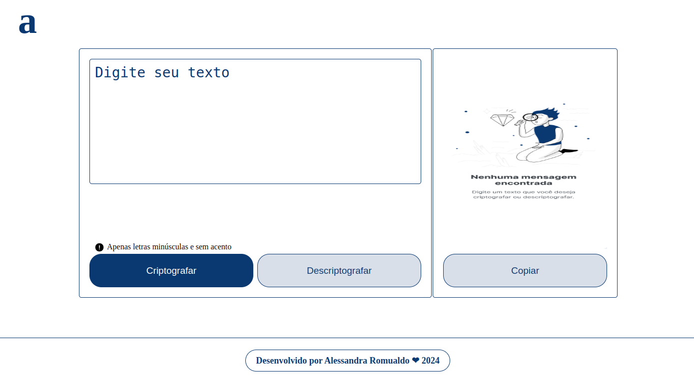

### Sprint 01: Construa um decodificador de texto com Javascript

Este repositório foi criado para o desafio  Decodificador de texto, do programa ONE

Desafio: Crie um decodificador de texto usando Javascript.

